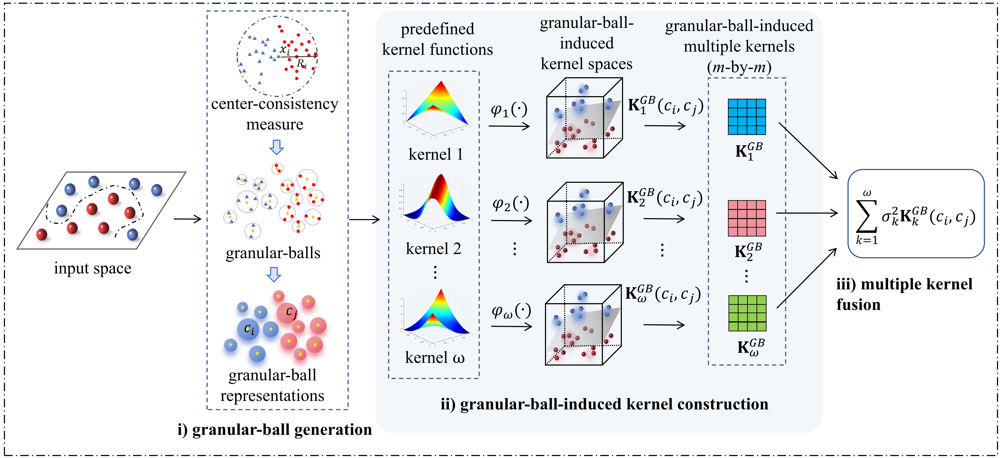

# Granular-ball-Induced Multiple Kernel K-Means

This repository provides the official implementation of our paper  
"Granular-ball-Induced Multiple Kernel K-Means", accepted at IJCAI 2025.

### Run the main program

To run the main script, simply execute:

GBSMKKM.m --dataset=JAFFE.

### main model

